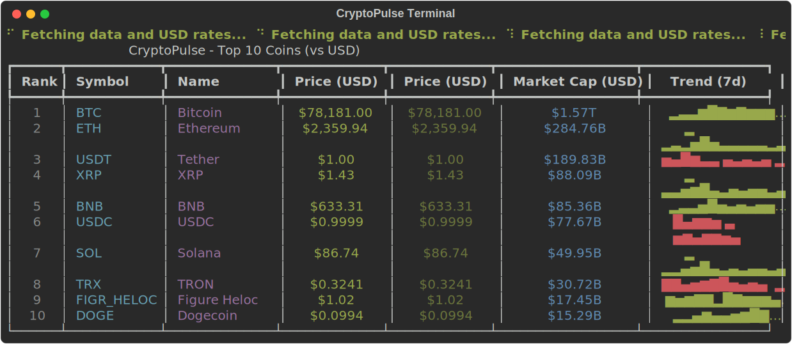

# CryptoPulse

High-performance, production-grade cryptocurrency CLI utility with high-precision financial logic and global currency support.

<p align="center">
  <h2 align="center">🚀 Features</h2>
</p>

- 🌍 **Real-time Global Data:** Fetch latest prices and market caps for top cryptocurrencies instantly.
- 💱 **Hybrid Conversion:** Seamless support for both fiat (EUR, NGN, JPY) and cross-crypto (SOL, ETH, BTC) valuations.
- 🎯 **High-Precision Math:** Powered by `decimal.Decimal` to eliminate floating-point errors in financial logic.
- 🛡️ **Resilient Infrastructure:** Automated retries and tiered caching (24hr TTL for rates, 60s for prices).
- 🎨 **Dynamic UI:** Beautifully formatted tables with sparklines and auto-updating headers via `Rich`.
- 🧘 **Minimalist Mode:** A focused `zen` view with curated market philosophy quotes for deep focus.
- 📸 **Auto-Doc Screenshots:** Generate high-fidelity SVG screenshots of any terminal output using the `--snap` flag.

## 🧙 The Wizard Commands

Speed is everything. CryptoPulse includes built-in 3-letter shorthands to bypass the full command prefix:

* **`cpl`** — Instant Market **L**ist
* **`cpw`** — Live Market **W**atcher
* **`cpz`** — Focused **Z**en Mode
* **`cpg`** — **G**lobal Market Analytics

## Visuals

Experience CryptoPulse in your terminal. These screenshots are **auto-generated** by the CLI's built-in `--snap` engine, ensuring they always reflect the latest UI.

### Market Overview
Experience multi-currency support with optimized layouts for high-value fiat conversions like NGN.




### Deep Analytics
<p align="center">
  
  
</p>

### Zen Mode
<p align="center">
  
</p>

### Live Monitoring


<p align="center">
  <a href="https://typer.tiangolo.com/"></a>
  <a href="https://rich.readthedocs.io/"></a>
  <a href="https://www.python-httpx.org/"></a>
  <a href="https://docs.pydantic.dev/"></a>
  <a href="https://docs.python.org/3/library/decimal.html"></a>
</p>

## Installation

```bash
# Clone the repository
git clone https://github.com/solocreativeone/cryptopulse.git
cd cryptopulse

# Set up virtual environment
python -m venv .venv
source .venv/bin/activate  # On Windows: .venv\Scripts\activate

# Install in editable mode with test dependencies
# NOTE: Editable mode (-e) is required to activate the shorthand wizard aliases!
pip install -e ".[test]"

# Configure environment variables
cp .env.example .env
# Edit .env with your API keys for enhanced rate limits
```

## Usage

The CLI command is `cryptopulse`. Shorthand commands are also available for instant access:
- `cpl` → `list`
- `cpw` → `watch`
- `cpz` → `zen`
- `cpg` → `global`

You can always use `cryptopulse --help` to see all available commands and options.

### List Top Coins
View the top 10 coins by market cap. You can specify any fiat or crypto currency for valuation and export data to JSON:
```bash
# Default (USD)
cpl

# Specified currency
cpl --currency eur
cpl -c sol

# Export to JSON file
cpl --export
cpl -e
```

### Coin Statistics
Get detailed information for a specific coin, including 24h highs/lows, ATH data, and a 7-day trend sparkline:
```bash
cryptopulse stat bitcoin
cryptopulse stat ethereum
```

### Global Market Data
View overall crypto market statistics:
```bash
cpg
```

### Real-time Watcher
Monitor specific coins in real-time with an auto-refreshing table:
```bash
# Watch Bitcoin and Solana every 10 seconds
cpw bitcoin sol --interval 10
```

### Zen Mode
Minimalist price view for a specific coin with curated market philosophy quotes:
```bash
cpz btc
```

### Network Resilience
CryptoPulse is built to survive outages and rate limits. If the primary API (CoinGecko) is unreachable or hits a 429 error, the system will:
1. **Switch Providers:** Automatically rotate to Mobula or CoinPaprika for fresh data.
2. **Local Fallback:** If all providers fail, it serves data from the 60s local cache.
3. **Stale Awareness:** Displays a `[stale]` warning panel to ensure users know they are viewing cached data.

### Configuration (Environment Variables)
For professional use, you can customize the provider endpoints in your `.env` file:
* `CP_COINGECKO_API_KEY`: Unlocks higher rate limits for CoinGecko.
* `CP_MOBULA_API_KEY`: Optional key for the Mobula fallback.
* `CP_COINGECKO_BASE_URL`: Override default endpoints (e.g., for Pro API).

### Debugging
Run any command with the `--debug` flag to see full technical tracebacks on failure:
```bash
cryptopulse list --debug
```

## 🏗️ Technical Architecture

### Engineering Focus
CryptoPulse is built with a focus on absolute precision and resilience:
- **Resilient Multi-Provider Fallback:** The system implements a sophisticated provider chain: `CoinGecko (Primary) → Mobula (Secondary) → CoinPaprika (Final)`. If a provider returns a 429 (Rate Limit) or is unreachable, the system automatically falls back to the next in line.
- **Tiered Data Caching:** High-speed cache stored in `~/.cryptopulse/` minimizes API overhead (60s for prices, 24hr for exchange rates).
- **Financial Integrity:** Powered by the `decimal` library to ensure 100% mathematical accuracy across all currency conversions.
- **Modern Architecture:** Fully compatible with Pydantic V2 for high-performance data validation and serialization.
- **Secure by Design:** Zero hardcoded API keys. All configuration is managed via `.env` files and `os.getenv` for production safety.

## Testing
Run the comprehensive test suite to verify precision and cache logic:
```bash
pytest
```

## 🧑‍💻 Maintainer

Developed and maintained by **SoloCreativeOne**.

[](https://x.com/solocreativeone)

This project is a testament to my engineering growth and technical specialization at the **Digital Bridge Institute**

## License
[MIT](LICENSE)
