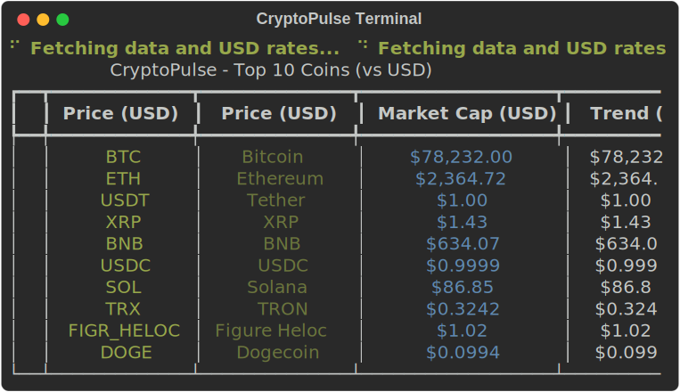
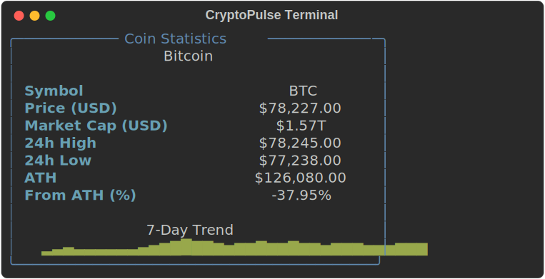
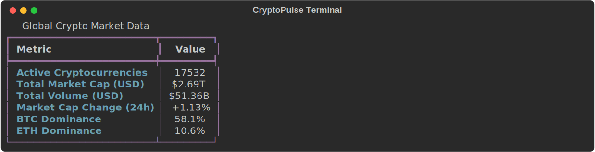
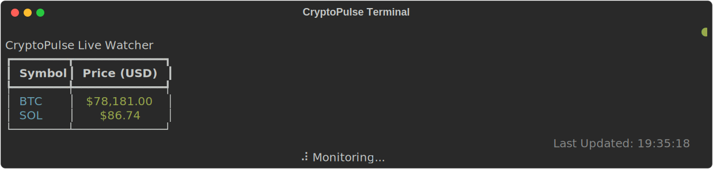

# CryptoPulse

High-performance, production-grade cryptocurrency CLI utility with high-precision financial logic and global currency support.

<p align="center">
  <h2 align="center">🚀 Features</h2>
</p>

- 🌍 **Real-time Global Data:** Fetch latest prices and market caps for top cryptocurrencies instantly.
- 💱 **Hybrid Conversion:** Seamless support for both fiat (EUR, NGN, JPY) and cross-crypto (SOL, ETH, BTC) valuations.
- 🎯 **High-Precision Math:** Powered by `decimal.Decimal` to eliminate floating-point errors in financial logic.
- 🛡️ **Resilient Infrastructure:** Automated retries and tiered caching (24hr TTL for rates, 60s for prices).
- 🎨 **Dynamic UI:** Beautifully formatted tables with sparklines and auto-updating headers via `Rich`.
- 🧘 **Minimalist Mode:** A focused `zen` view with curated market philosophy quotes for deep focus.

## Visuals

Experience CryptoPulse in your terminal. These screenshots are automatically generated using the `--snap` flag.

### Market Overview


### Deep Analytics
<p align="center">
  
  
</p>

### Zen Mode
<p align="center">
  
</p>

### Live Monitoring


<p align="center">
  <a href="https://typer.tiangolo.com/"></a>
  <a href="https://rich.readthedocs.io/"></a>
  <a href="https://www.python-httpx.org/"></a>
  <a href="https://docs.pydantic.dev/"></a>
  <a href="https://docs.python.org/3/library/decimal.html"></a>
</p>

## Installation

```bash
# Clone the repository
git clone https://github.com/solocreativeone/cryptopulse.git
cd cryptopulse

# Install in editable mode with test dependencies
pip install -e ".[test]"
```

## Usage

The CLI command is `cryptopulse`. Shorthand commands are also available for instant access:
- `cpl` → `list`
- `cpw` → `watch`
- `cpz` → `zen`
- `cpg` → `global`

You can always use `cryptopulse --help` to see all available commands and options.

### List Top Coins
View the top 10 coins by market cap. You can specify any fiat or crypto currency for valuation and export data to JSON:
```bash
# Default (USD)
cpl

# Specified currency
cpl --currency eur
cpl -c sol

# Export to JSON file
cpl --export
cpl -e
```

### Coin Statistics
Get detailed information for a specific coin, including 24h highs/lows, ATH data, and a 7-day trend sparkline:
```bash
cryptopulse stat bitcoin
cryptopulse stat ethereum
```

### Global Market Data
View overall crypto market statistics:
```bash
cpg
```

### Real-time Watcher
Monitor specific coins in real-time with an auto-refreshing table:
```bash
# Watch Bitcoin and Solana every 10 seconds
cpw bitcoin sol --interval 10
```

### Zen Mode
Minimalist price view for a specific coin with curated market philosophy quotes:
```bash
cpz btc
```

### Network Resilience
CryptoPulse is designed for unstable connections. If the API is unreachable, it will:
1. Automatically fallback to the local cache.
2. Display a warning panel: `Network unreachable. Using local cache...`
3. Provide "Stale" markers in live watcher mode.

### Debugging
Run any command with the `--debug` flag to see full technical tracebacks on failure:
```bash
cryptopulse list --debug
```

## Testing
Run the comprehensive test suite to verify precision and cache logic:
```bash
pytest
```

## License
MIT
